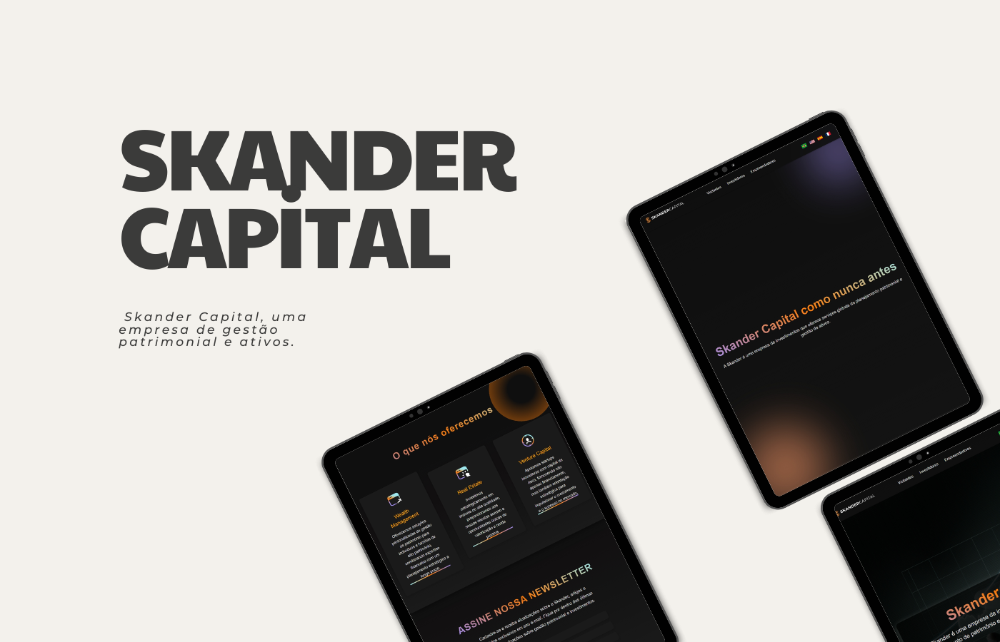

# Skander Capital - Gestão Patrimonial e Ativos

## 🖼️ Mockup do Site

Clique na imagem acima para acessar o site oficial da Skander Capital.

## 🌍 Sobre o Projeto

Bem-vindo ao repositório do site da **Skander Capital**. Como desenvolvedor freelancer, fui contratado para criar um site multilíngue e responsivo para a Skander Capital, uma empresa de gestão patrimonial e ativos, que oferece soluções globais de investimento e planejamento patrimonial para indivíduos de altíssimo patrimônio. Este projeto reflete o compromisso da Skander Capital com a excelência, transparência e inovação no mercado financeiro global.

### 🚀 Objetivo do Projeto

O objetivo principal é desenvolver um site corporativo que represente a **Skander Capital** como uma empresa líder no setor de investimentos, oferecendo conteúdo em múltiplos idiomas (Português, Inglês, Espanhol e Francês), com uma experiência de usuário intuitiva e acessível, alinhada com a identidade visual da marca.

## 🖥️ Funcionalidades

- **Multilinguismo**: O site suporta quatro idiomas: Português, Inglês, Espanhol e Francês, permitindo alcançar um público global.
- **Gerenciamento de Conteúdo Dinâmico**: Uso de JavaScript para carregar o conteúdo do site de acordo com o idioma preferido do usuário, armazenado no navegador.
- **Design Responsivo**: Layout otimizado para dispositivos móveis e desktops, garantindo uma experiência de navegação agradável em qualquer dispositivo.
- **Formulários Interativos**: Formulários de contato, inscrição para newsletter e canal de denúncias, todos com validação de dados.
- **SEO e Acessibilidade**: Otimizado para mecanismos de busca e acessibilidade, com uso de tags de metadados adequadas e suporte para leitores de tela.

## 📂 Estrutura do Projeto

O projeto está organizado em diferentes páginas HTML, cada uma destinada a um tipo de usuário ou funcionalidade específica:

1. **index.html:** Página principal do site, introduzindo a Skander Capital aos visitantes.
2. **investidores.html:** Área exclusiva para investidores, com acesso seguro e informações dedicadas.
3. **empreendedores.html:** Área de suporte a empreendedores, incluindo upload seguro de documentos e contato.
4. **visitantes.html:** Página dedicada a apresentar os serviços e a equipe da Skander Capital.

- **css/visitantes.css**: Estilos customizados para o layout e design do site.
- **images/**: Diretório contendo todas as imagens usadas no site, incluindo logotipos e ícones.

## 🌐 Tecnologias Utilizadas

- **HTML5**: Estrutura básica do site e conteúdo semântico.
- **CSS3**: Estilização e design responsivo do site.
- **JavaScript**: Funcionalidades dinâmicas, como mudança de idioma e validação de formulários.
- **Google Fonts**: Integração com fontes personalizadas para melhorar a estética visual.

## 📜 Conteúdo do Site

### 1. **Página Inicial**: 
Página inicial para visitantes, com apresentação da empresa e links para outras áreas.

### 2. **Página Visitantes**

A página visitantes introduz os visitantes à **Skander Capital**, com apresentação da empresa e links para outras áreas:
- **Wealth Management**: Gestão de patrimônio personalizada.
- **Real Estate**: Investimentos estratégicos em imóveis.
- **Venture Capital**: Apoio financeiro e estratégico a startups inovadoras.

- **Quem Somos?**: Apresentação da missão, visão e valores da Skander Capital.
- **Equipe**: Destaques sobre a expertise e a experiência da equipe de gestão.
- **Serviços**: Descrição detalhada dos serviços oferecidos, incluindo gestão de patrimônio, investimentos imobiliários e capital de risco.
- **Newsletter**: Seção para inscrição na newsletter da Skander, mantendo os clientes informados sobre atualizações e conteúdos exclusivos.
- **Contato**: Formulário para os visitantes entrarem em contato com a empresa.
- **Canal de Denúncias**: Formulário exclusivo para denúncias, conforme normas legais.

### 3. **Investidores**: 
Área exclusiva para investidores, incluindo informações sobre segurança e login.

### 4. **Empreendedores**: 
Seção dedicada a empreendedores, com formulário de contato e envio de documentos.

## 📊 SEO e Otimização

O site foi desenvolvido com práticas recomendadas de SEO, incluindo:
- Meta tags para título, descrição e palavras-chave.
- Tags Open Graph para melhor compartilhamento em redes sociais.
- Conteúdo estruturado e semântico.

## 📢 Contribuições

Se você deseja contribuir para este projeto, por favor, siga estas etapas:

1. Faça um fork do repositório.
2. Crie uma branch para suas alterações (`git checkout -b feature/AmazingFeature`).
3. Commit suas mudanças (`git commit -m 'Add some AmazingFeature'`).
4. Envie para a branch (`git push origin feature/AmazingFeature`).
5. Abra um Pull Request.

## 📧 Contato

Caso tenha alguma dúvida ou sugestão, fique à vontade para entrar em contato:

- **Email**: [contato@skandercapital.com](mailto:contato@skandercapital.com)
- **LinkedIn**: [Skander Capital](https://www.linkedin.com/company/skander-capital/)

---

    <strong>© 2024 Skander Capital. Todos os direitos reservados.</strong>

